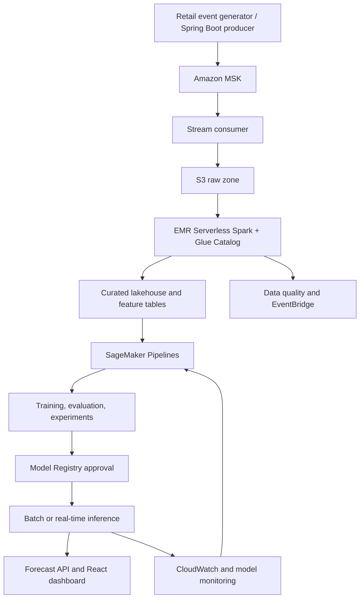

# DemandPulse
Streaming demand forecasting and inventory risk platform on AWS


# DemandPulse

## Streaming demand forecasting and inventory risk platform on AWS

### 1. Purpose

Build a portfolio-grade ML engineering system that predicts **the next 7-day product demand per store**, identifies likely stockouts, and produces explainable reorder recommendations. The platform ingests continuously arriving sales and inventory events, maintains a governed data lake, prepares features at scale, trains and deploys a model, and monitors the model after release.

The project is deliberately designed as a production-style system, not a notebook that trains a model once. It proves data engineering, ML engineering, MLOps, security, monitoring, and cost-aware AWS architecture.

**Suggested portfolio line:**

> Built DemandPulse, an event-driven AWS ML platform that streams retail sales events through Amazon MSK, transforms a governed S3 data lake with EMR Serverless, trains and governs demand-forecasting models with SageMaker Pipelines, and serves monitored stockout predictions through a secure API.

### 3. Business scenario

A multi-store retailer loses sales when fast-moving products go out of stock and wastes money when it over-orders slow products. Sales transactions and inventory updates arrive throughout the day. Operations staff need a daily demand forecast, a stockout risk score, and a defensible reorder quantity for each product-store pair.

The platform must answer:

1. How many units of product *p* will store *s* sell in the next 7 days?
2. Which product-store pairs have a high probability of stockout before the next replenishment?
3. How many units should the store order after considering safety stock and lead time?
4. Is the deployed model still trustworthy, or has the data/prediction distribution shifted?

### 4. Scope and intentional boundaries

**In scope**

- Synthetic event generator plus an open retail/demand-history dataset for backtesting.
- Sales, inventory, catalogue, promotion, and store-calendar data.
- Near-real-time ingestion and hourly feature refresh; daily batch training/evaluation.
- One baseline and one production candidate model.
- Real-time or asynchronous inference API and a small operations dashboard.
- Infrastructure as code, tests, runbooks, monitoring, and a teardown script.

**Out of scope for v1**

- Payment processing, customer PII, ordering suppliers, and a multi-tenant product.
- Perfect real-time learning. Online inference does not mean training after every event.
- A deep-learning model merely to look advanced. A well-evaluated gradient-boosting model is a stronger first production candidate.

### 5. Users and functional requirements

| User | Main needs |
| --- | --- |
| Operations analyst | View forecast, stockout risk, recommended quantity, model version, and explanation for a store/SKU/date. |
| Data/ML engineer | Trigger or inspect pipeline runs, compare experiments, approve a candidate model, investigate alarms, and roll back. |
| System integrator | Submit sales/inventory events and request a forecast through documented APIs. |

#### 5.1 Event ingestion

- The platform shall accept `sale.created`, `inventory.updated`, `product.updated`, and `promotion.updated` events.
- A local producer and a small Spring Boot producer service shall generate realistic events, including late, duplicate, malformed, and out-of-order messages.
- Events shall use a schema version, immutable event ID, event timestamp, producer timestamp, and correlation ID.
- The system shall retain raw messages in an S3 immutable/raw zone and route invalid messages to a dead-letter path with an observable failure reason.
- The platform shall tolerate duplicate delivery by using idempotent processing keyed by `event_id`.

#### 5.2 Data lake and processing

- S3 shall contain `raw`, `validated`, `curated`, `features`, `model-artifacts`, `monitoring`, and `audit` prefixes (or equivalent buckets).
- The raw zone must never be updated in place. Curated datasets must be reproducible from raw events and code.
- An EMR Serverless Spark job shall validate schemas, deduplicate events, correct late-arrival windows, join catalogue/calendar data, and write partitioned Parquet/Iceberg curated tables.
- AWS Glue Data Catalog shall register datasets. Athena queries must support an analyst's forecast-accuracy and inventory-risk investigations.
- Data quality checks must include schema validity, null thresholds, unique event IDs, non-negative units, valid product/store IDs, volume anomaly checks, and freshness SLA.
- Failed quality gates shall prevent downstream training and publish a notification.

#### 5.3 Feature engineering

- Create a daily feature set keyed by `store_id`, `product_id`, and `forecast_date`.
- Minimum features: lagged sales (1, 7, 14, 28 days), rolling averages/variance, day-of-week, weekend/holiday flag, promotion flag, price, current inventory, lead time, product category, and recent stockout indicator.
- The project shall prevent time leakage: each feature for date *t* uses only information available before the forecast cut-off for *t*.
- Store feature definitions and feature lineage in version-controlled code. Optionally write online/offline features to SageMaker Feature Store; S3/Glue remains the source of truth for the batch training set.

#### 5.4 Training and evaluation

- Establish a naive seasonal baseline (for example, same weekday from the previous week) before using ML.
- Train an initial XGBoost model using SageMaker Training. A Prophet/DeepAR or custom PyTorch comparison is optional, not required.
- Use time-based train/validation/test splits, never random row splitting.
- Track experiments, parameters, code commit SHA, data snapshot/partition range, metrics, model artifact URI, and evaluation report in SageMaker Experiments.
- Evaluate WAPE and RMSE globally and by store/category. Evaluate stockout classification with precision/recall or PR-AUC after a business-approved risk threshold is chosen.
- Register a model only if it improves WAPE by at least 10% over the baseline and does not violate slice-level quality thresholds.
- Write a model card documenting data, intended use, metrics by slice, limitations, operational owner, and rollback version.

#### 5.5 Orchestration and deployment

- SageMaker Pipelines shall orchestrate processing, training, evaluation, conditional registration, and model registration.
- EventBridge shall trigger the daily pipeline when the curated data partition is complete; Step Functions may orchestrate cross-service error handling and notifications.
- A model must require a manual approval gate from `PendingManualApproval` to `Approved` before production deployment.
- Deployment shall support either:
  - **Recommended v1:** batch/asynchronous inference writes a daily forecast table to S3 and DynamoDB; or
  - **v2:** real-time SageMaker endpoint behind API Gateway for a single product-store request.
- The deployment workflow must support blue/green or canary rollout, CloudWatch alarm-based rollback, and an explicit previous-model redeploy procedure.

#### 5.6 Prediction and recommendation experience

- Expose `POST /events`, `GET /forecasts?storeId=&productId=&date=`, and `GET /recommendations?storeId=&date=`.
- A recommendation must return `predictedDemand`, `availableInventory`, `safetyStock`, `leadTimeDays`, `recommendedOrderQuantity`, `stockoutRisk`, `modelVersion`, `generatedAt`, and an explanation summary.
- Reorder quantity can use the transparent initial rule:

  `max(0, predicted demand during lead time + safety stock - available inventory - confirmed inbound units)`

- A React dashboard shall show a filterable risk table, a 28-day actual-vs-forecast trend, top features/explanation, model version, and data freshness.

#### 5.7 Monitoring and maintenance

- CloudWatch dashboards shall show producer throughput, MSK consumer lag, invalid-event count, EMR job result/duration, pipeline status, endpoint latency/error rate, and daily inference volume.
- SageMaker Model Monitor (or a scheduled custom monitoring job) shall detect missing features, schema changes, feature drift, prediction drift, and data freshness failures.
- When later actuals arrive, calculate production WAPE and alert when it exceeds the approved model's threshold for three consecutive days.
- An EventBridge rule shall trigger a retraining review when data drift, performance degradation, a catalogue shift, or the regular 30-day cadence occurs. A trigger creates a candidate only; it must never silently overwrite production.
- All operational alerts must name the affected data date/model version and link to an investigation runbook.

### 6. High-level architecture



### 7. AWS service responsibilities

| Service | Responsibility | What you should demonstrate |
| --- | --- | --- |
| Amazon MSK | Kafka-compatible durable event stream | Topics, partitions, consumer groups, retention, consumer lag, replay, schema/version strategy. |
| Amazon S3 | Data lake and model/monitoring storage | Prefix design, partitioning, versioning, lifecycle, encryption, least privilege. |
| AWS Glue + Lake Formation | Catalogue, discovery, governed data access | Table discovery, crawler/catalogue choice, grants, Athena query access. |
| Amazon EMR Serverless | Scalable Spark transformation | Job packaging, IAM runtime role, Spark tuning, retries, output partitioning. |
| Amazon Athena | Ad hoc lake investigations | Accuracy/risk queries and cost-aware partition pruning. |
| SageMaker AI | Processing/training/evaluation, Experiments, Pipelines, Model Registry, monitoring/inference | End-to-end ML lifecycle, reproducibility, model governance, production monitoring. |
| EventBridge + Step Functions | Scheduling, event-driven starts, orchestration, failure paths | Decoupled triggers and controlled retries/notifications. |
| API Gateway + Lambda/ECS | Forecast/recommendation API | Authenticated service boundary and validation. |
| DynamoDB | Low-latency daily forecast/recommendation read model | Key design and TTL/versioned forecast snapshots. |
| CloudWatch + CloudTrail | Metrics, alarms, logs, audit | SLO dashboard, alerting, audit evidence. |
| IAM, KMS, Secrets Manager, VPC | Secure-by-default foundation | Role separation, encryption, secrets, private service access. |
| CDK/Terraform + CodePipeline/GitHub Actions | Repeatable infrastructure and delivery | No click-ops dependency; environment promotion and teardown. |

**Important terminology:** use the phrase *data pipeline* for this architecture. Do not add the legacy **AWS Data Pipeline** service merely for the name; use Glue/EMR, EventBridge, Step Functions, and SageMaker Pipelines because they fit the workload and demonstrate current architectural judgment.

### 8. Data contracts

#### 8.1 Sale event

```json
{
  "schema_version": "1.0",
  "event_id": "uuid",
  "event_type": "sale.created",
  "event_time": "2026-09-23T10:15:00Z",
  "store_id": "COL-001",
  "product_id": "SKU-1832",
  "units": 2,
  "unit_price": 845.00,
  "promotion_id": "PROMO-2026-09",
  "correlation_id": "uuid"
}
```

#### 8.2 Inventory event

```json
{
  "schema_version": "1.0",
  "event_id": "uuid",
  "event_type": "inventory.updated",
  "event_time": "2026-09-23T10:20:00Z",
  "store_id": "COL-001",
  "product_id": "SKU-1832",
  "on_hand_units": 27,
  "inbound_units": 10,
  "lead_time_days": 4,
  "correlation_id": "uuid"
}
```

No customer name, email, phone number, payment reference, or other PII belongs in these events. This simplifies the public portfolio dataset and demonstrates privacy-by-design.

### 9. Non-functional requirements

| Area | Requirement |
| --- | --- |
| Availability | Daily batch forecasts available by 07:00 local business time; v2 API target: 99.5% monthly availability. |
| Freshness | Validated sales/inventory data visible in curated tables within 60 minutes of event time under normal load. |
| Performance | Batch result query p95 under 1 second from DynamoDB; v2 real-time inference p95 under 500 ms, excluding cold start. |
| Reliability | At-least-once ingestion with idempotent consumers; failed records are retained and recoverable. |
| Security | Encrypt at rest with KMS and in transit with TLS; least-privilege roles; secrets never committed; CloudTrail enabled. |
| Reproducibility | Any production forecast is traceable to source partition, feature code version, model artifact, evaluation report, and deployment version. |
| Cost | No always-on cluster in development; budgets and anomaly alerts enabled; every resource has an owner/environment tag and teardown path. |

### 10. Delivery phases

#### Phase 0 - Architecture and local baseline (2-3 days)

- Write the architecture decision records, data dictionary, event schemas, and threat model.
- Build a Python/Spring Boot event generator and use local Kafka or Docker Compose first.
- Load historical demand data into local Parquet; produce a naive seasonal baseline and a reproducible metric report.
- Create the repository, CI lint/test workflow, `.env.example`, and a cost log.

**Exit evidence:** architecture diagram, working producer, validated sample events, baseline notebook/script, and screenshots/tests.

#### Phase 1 - Lakehouse and batch ML MVP (5-7 days)

- Provision S3, KMS, IAM, Glue Catalog, Athena, EMR Serverless, SageMaker roles, and budgets with CDK or Terraform.
- Land raw events in S3, transform them with EMR Serverless, register curated tables, and run quality checks.
- Train/evaluate XGBoost in SageMaker and register the first approved candidate.
- Produce daily batch predictions to S3/DynamoDB and expose the read API.

**Exit evidence:** reproducible infrastructure deployment, Athena query results, EMR logs, training/evaluation report, Model Registry entry, and API response.

#### Phase 2 - Streaming and MLOps (5-7 days)

- Replace local Kafka with MSK (or use MSK only for a short scheduled demo window); configure topic ACLs, consumers, lag alarms, and replay.
- Build a SageMaker Pipeline with conditional registration and manual approval.
- Add EventBridge/Step Functions orchestration, Model Monitor/custom monitoring, retraining trigger, and rollback runbook.
- Add CloudWatch dashboard, alarms, and an end-to-end integration test that injects a bad event and proves DLQ recovery.

**Exit evidence:** pipeline graph, approval history, drift/alarm demonstration, consumer-lag dashboard, and rollback demo recording.

#### Phase 3 - Product and advanced extension (3-5 days)

- Build the React dashboard with explainability and actual-vs-predicted trends.
- Add endpoint canary deployment or asynchronous inference as appropriate.
- Optional MLA-C02 extension: use Amazon Bedrock to generate a constrained plain-language explanation from approved numeric inputs and retrieved model-card/runbook excerpts. It must never invent forecast values, and every answer must show its source model/version.

**Exit evidence:** deployed dashboard, 3-minute demo video, portfolio case study, and teardown verification.

### 11. Technical decisions you must be able to defend in an interview

| Decision | Defensible reasoning |
| --- | --- |
| MSK instead of synchronous API-only ingestion | Kafka gives durable buffering, replay, decoupled producers/consumers, and a clear streaming-data demonstration. It increases cost/operations, so use it only for the demo environment. |
| EMR Serverless instead of a permanent EMR cluster | Spark is appropriate for scalable joins/windows and data lake batch work; serverless avoids idle clusters. Glue ETL would be a valid simpler alternative. |
| Batch forecasts before a real-time endpoint | Daily replenishment decisions are usually batch; batch is cheaper and operationally simpler. Real-time inference is a deliberate v2 requirement, not a reflex. |
| Gradient boosting before deep learning | Structured tabular/lags features have a strong, interpretable baseline. Add DeepAR only if it beats the baseline and its cost/complexity is justified. |
| Time-based split | Random split leaks the future into training and gives deceptively optimistic results. |
| Manual promotion and rollback | Automation produces candidates; governance protects production from weak or biased models. |
| Feature Store optional | It becomes valuable when online and offline feature consistency is real. Avoid adding it just to list another service. |

### 12. Testing and acceptance criteria

The capstone is complete only when all of the following are true:

- [ ] Replaying the same event batch produces no duplicate curated sales records.
- [ ] A malformed or schema-incompatible event reaches the DLQ/error path and raises an observable alarm.
- [ ] Data quality failure blocks training and leaves the production model unchanged.
- [ ] The model beats the published naive baseline on the held-out time period and meets slice-level thresholds.
- [ ] A model cannot deploy unless it is registered and manually approved.
- [ ] Every response exposes model version and generation timestamp.
- [ ] Injected feature/prediction drift creates an alarm and retraining candidate workflow, without automatically changing production.
- [ ] Rollback restores the previous known-good model and passes a smoke test.
- [ ] IAM policy tests show the dashboard/API role cannot write raw data or invoke training.
- [ ] `destroy`/teardown removes paid development resources, with S3 retention handled deliberately.

### 13. Repository structure

```text
demand-pulse/
  infra/                    # CDK or Terraform
  services/
    event-producer/         # Spring Boot or Python producer
    forecast-api/           # API Gateway Lambda or ECS service
  data/
    schemas/                # JSON Schema / Avro contracts
    generators/             # synthetic data and fault injectors
  pipelines/
    emr/                    # Spark jobs
    sagemaker/              # processing, training, evaluation, pipeline definition
  ml/
    features/
    training/
    evaluation/
    monitoring/
  frontend/                 # React dashboard
  tests/
    unit/
    integration/
    smoke/
  docs/
    architecture.md
    model-card.md
    runbook.md
    cost-controls.md
```

### 14. Cost-control checklist

- Start locally. Deploy each AWS phase only when its tests are ready.
- Prefer EMR Serverless jobs with a hard stop over persistent EMR clusters.
- Use MSK for a documented short demonstration window; delete it immediately afterward. Keep an optional local-Kafka profile for normal development.
- Use one small SageMaker training job, stop endpoints when not demonstrating, and prefer asynchronous/batch inference for the default path.
- Use small, partitioned sample data; add S3 lifecycle rules and logs retention periods.
- Configure AWS Budgets, Cost Anomaly Detection, tags (`project`, `environment`, `owner`, `expiry`), and an automated expiry reminder before deployment.
- Never claim the project uses the AWS Free Tier end-to-end: MSK, EMR, SageMaker, NAT gateways, and endpoints can incur meaningful charges.

### 15. Portfolio deliverables

- Public GitHub repository with an architecture diagram, one-command local demo, IaC, tests, clear cost warning, and teardown instructions.
- A 3-5 minute demo showing producer event -> S3/EMR transformation -> pipeline training -> approved model -> forecast dashboard -> injected drift/rollback.
- Screenshots or sanitized exports of SageMaker Pipeline, Experiment/Model Registry, EMR Serverless job, Athena query, CloudWatch dashboard, and MSK consumer lag.
- A short case study explaining the business problem, design trade-offs, metrics vs baseline, security/cost choices, incident simulation, and next steps.

### 16. Future extensions

- Compare XGBoost with DeepAR and a global time-series transformer.
- Add a SageMaker Feature Store online store only when serving truly needs fresh features.
- Add Amazon Bedrock RAG over the model card, data dictionary, and operational runbooks to answer analyst questions with citations.
- Add fairness/coverage checks across store regions and product categories.
- Add data-contract compatibility checks to CI and a schema registry.
- Simulate regional recovery from curated S3 data and rebuild the serving stack using IaC.

### Reference context

- AWS describes the updated MLA-C02 beta as covering production ML/GenAI operationalization, including Bedrock, RAG, agentic AI, foundation models/LLMs, and responsible AI. The current certification page also differentiates it from the existing MLA-C01 version.
- The MLA-C01 in-scope service list includes Amazon EMR, AWS Glue, Athena, EventBridge, Step Functions, MSK-adjacent streaming technologies, SageMaker, CloudWatch, IAM, KMS, and S3. The list is non-exhaustive and subject to change.

Official sources: [AWS Certified Machine Learning Engineer - Associate](https://aws.amazon.com/certification/certified-machine-learning-engineer-associate/) and [AWS in-scope services](https://docs.aws.amazon.com/aws-certification/latest/machine-learning-engineer-associate-01/mla-01-in-scope-services.html).
